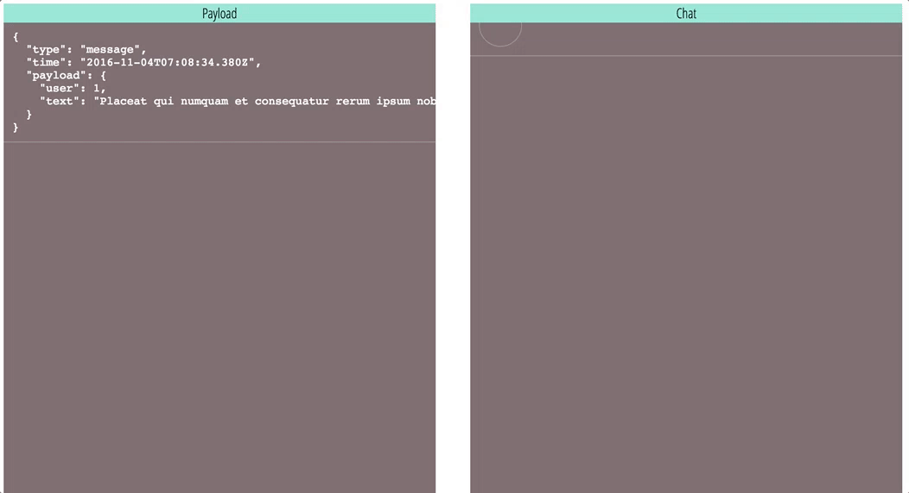

<p align="center">
  
</p>

# [](https://travis-ci.org/zzarcon/chaosocket) [](https://badge.fury.io/js/chaosocket) :bomb: :zap: :boom: :fire: :smiling_imp: 
> Mock WebSockets and create chaos [DEMO](http://zzarcon.github.io/chaosocket)

The motivation of this project is nothing but being able to receive predefined socket messages. Why this? usually when integrating and testing web sockets in your app it happen that you have no control over the messages you are getting. This leads to slow iterations, like having to test you app against a real source of messages (production) or not doing it at all...

Chaosocket aims to provide you a set of tools to test this sort of behaviours, also it respects the WebSocket interface, making this transparent to you, this means that you don't have to modify your code at all when you introduce the library in your app. So it's perfect for simple scenarios like **what happen when the user name is longer than 50 chars**? to complex ones in which **you want to stress your UI with 20 messages per second**.

## Defining chaos boundaries :triangular_ruler:

**Chaos registration**
```javascript
const chaos = require('chaosocket');

chaos.register(() => {
  return {
    type: 'connection',
    user: {
      name: 'Hector'
    }
  };
});

chaos.listen();
```

**Socket usage**
```javascript
const socket = new WebSocket('ws://0.0.0.0:8080');

socket.onmessage = function(e) {
  const msg = JSON.parse(e.data);

  console.log(msg.type, msg.user);
};
```

Chaosocket will call your message callback by time to time depending in some factors with the result of your registration.

**Frequency**

Sometimes you want to receive more events from a specific type, you achieve that by specifying the **frequency** of the registration. Default value is `medium` and the available ones are `low`, `medium` and `high`. Based on it chaosocket will emit events more or less often.

```javascript
chaos.register(() => {
  return {
    type: 'connection'
  };
}, 'low');

chaos.register(() => {
  return {
    type: 'typing'
  };
}, 'medium');

chaos.register(() => {
  return {
    type: 'message'
  };
}, 'high');
```

**Delay**

This will change the default delay (2000ms) to 500ms forcing the app to handle x4 more events.

```javascript
chaos.listen({
  delay: 500
});
```

## Stop chaos :no_entry:
Tired of chaos? just `close` it and the socket will stop to recieve fake messages.

```javascript
chaos.close();
```

## Using Faker :ghost:
Chaosocket comes with [Faker](https://github.com/marak/Faker.js/), a library to generate fake and random data easily, it's passed to the **register** method.

```javascript
chaos.register((faker) => {
  return {
    create_at: faker.date.recent(),
    event_name: faker.random.arrayElement(['connection', 'typing', 'message']),
    first_name: faker.name.firstName(),
    last_name: faker.name.lastName(),
    bio: faker.lorem.text()
  };
});
```

You can find all Faker methods here https://github.com/marak/Faker.js/#api-methods

## Demo :rocket:

<p align="center">
  Just a simple chat using the library
  
</p>

* Live demo [zzarcon.github.io/chaosocket](http://zzarcon.github.io/chaosocket)
* Demo code https://github.com/zzarcon/chaosocket/tree/gh-pages

## Installation :wrench:

```
$ npm i chaosocket -D
```

## Dependencies :bow:
  * [Faker](https://github.com/marak/Faker.js/)

## Author :person_with_blond_hair:

Hector Zarco [@zzarcon](https://twitter.com/zzarcon)